# 💼 softcomshop-challenge

## 🙋‍♂️ Sobre mim

Olá! Me chamo Micael Lucas, e sou colaborador da Softcom com interesse em crescer junto com a empresa, contribuindo e colaborando com o máximo que conseguir.

Estou cursando o 6° período de Ciência da Computação.

Sou uma pessoa dedicada, com sede de aprendizado, focado, direto e organizado.

---

## 🧪 Tecnologias que utilizo

- PHP
- JavaScript
- HTML / CSS
- Bootstrap
- Git e GitHub
- MySQL
- Apache (configuração de ambientes locais)

---

## 📂 Projetos Desenvolvidos

### 🏠 Sistema de Gestão de Propriedades

Sistema web para controle de propriedades, contratos de aluguel, contas a receber e organização financeira do proprietário.

- Login com senha criptografada
- Cadastro de clientes, propriedades e usuários
- Geração e controle de parcelas de aluguel
- Módulo de pagamentos e comprovantes
- Sistema de notificações (aluguéis vencidos, pagos ou próximos)
- Suporte a multiempresas
- Atualização automática via upload `.zip`

📸 Prints do sistema:

- 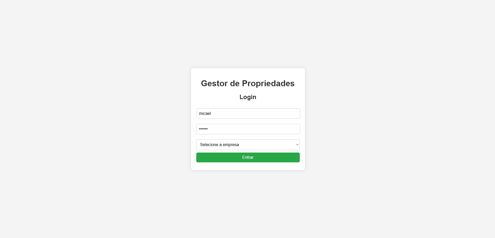
- 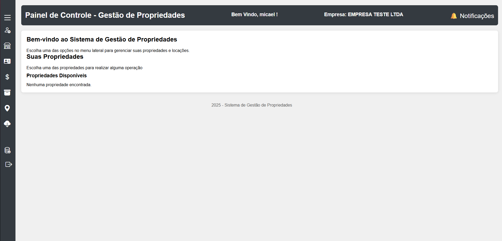
- 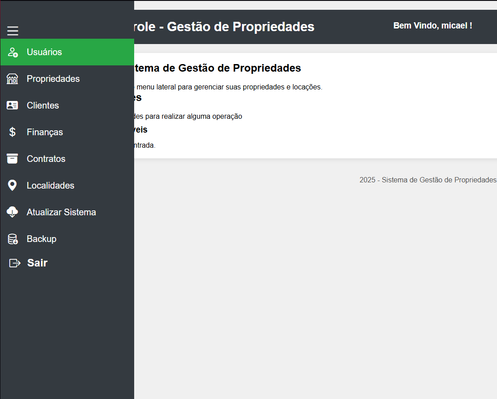
- 
- 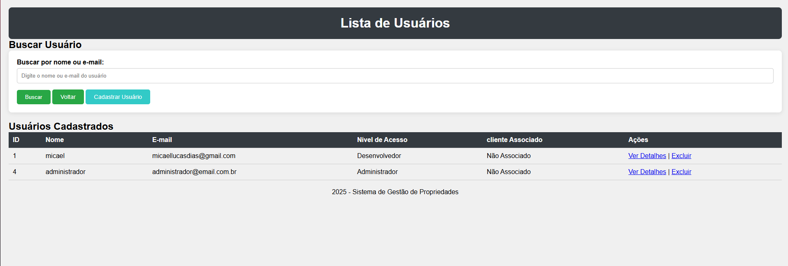
- 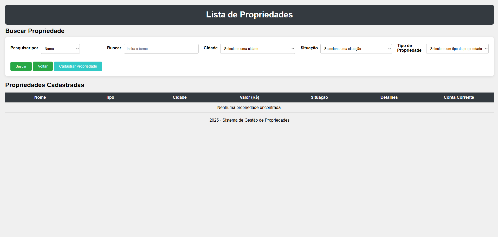
- 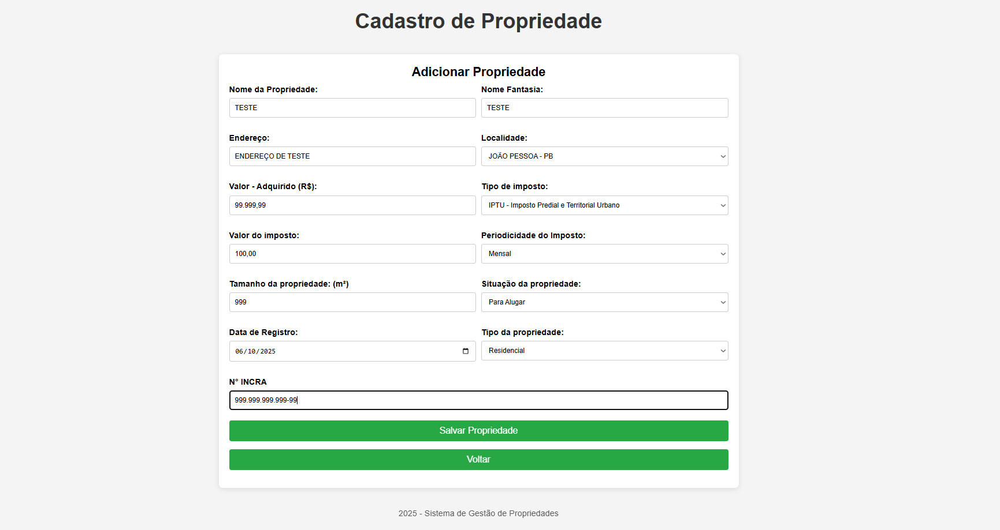
- 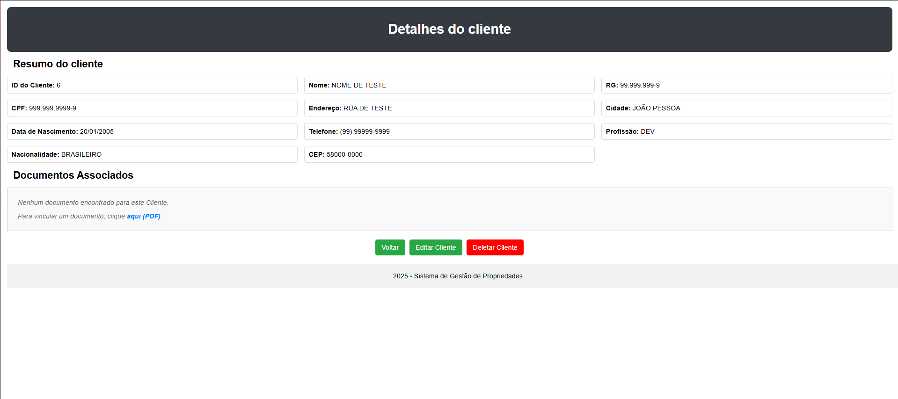
- 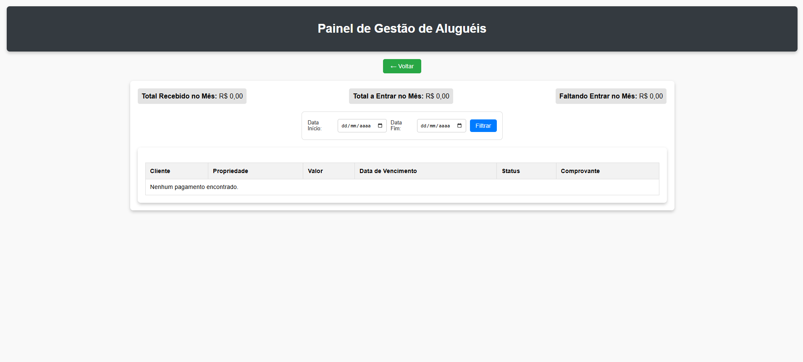
- 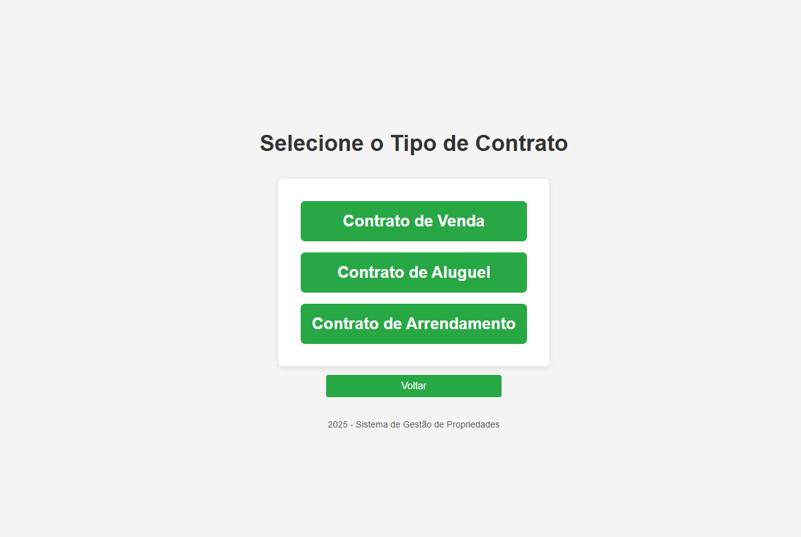
- 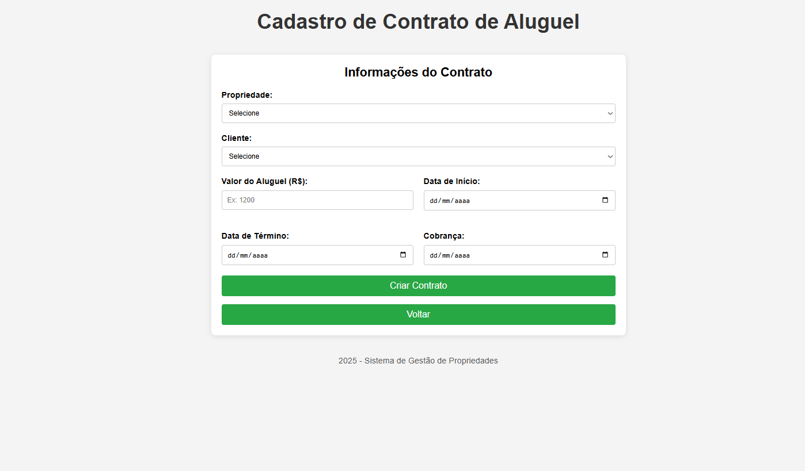
- 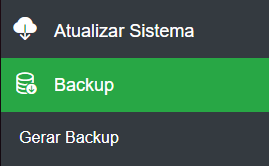

---

## 🚀 Considerações Finais

Estou empolgado com a possibilidade de crescer profissionalmente na área de desenvolvimento da empresa.

Agradeço pela oportunidade e estou me preparando da melhor forma possível para os desafios presenciais.

